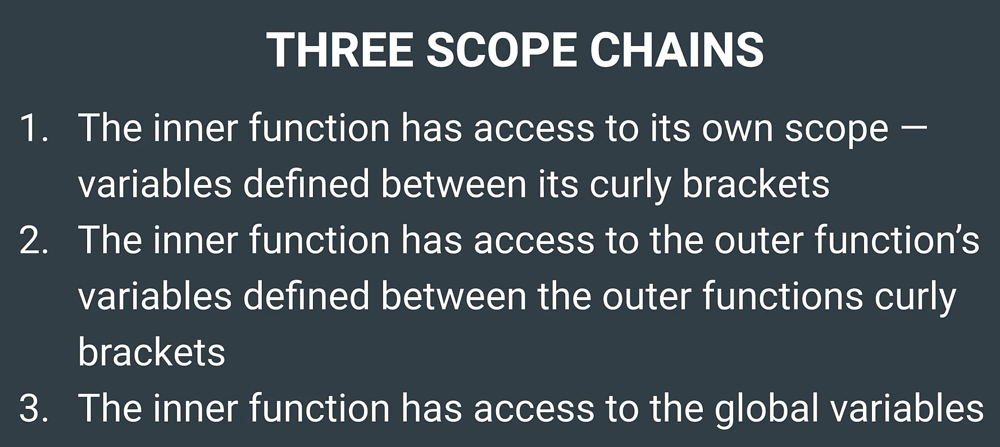

# Computer Science for JavaScript

Module 17-Computer Science for JavaScript

## 1. JavaScript's Data Structures

- The stack and queue are considered linear data structures because they have a logical beginning and end.
- A heap is a two-dimensional structure with a hierarchical organization.

### 1.1 Stack

- The stack used in JavaScript is called the call stack.
- The call stack is where JavaScript executes and evaluates the code.
- Last In, First Out—or LIFO: The last item added onto the stack is also the first item to be removed.
  - push: adds an element from the end of the array
  - pop: removes an element from the end of the array

### 1.2 Queue

- The queue used in JavaScript is named the callback queue.
- The callback queue and the event loop enable JavaScript to handle asynchronous functions.
- First In, First Out—or FIFO
  - push: adds elements to the array to the end.
  - shift: removes items from the front of the array,

### 1.3 Heap

- The heap used in JavaScript is called the memory heap.
- The memory heap is where data is stored.

### 1.4 Closures

Closure is "when you have a function defined inside of another function, that inner function has access to the variables and scope of the outer function even if the outer function finishes executing and those variables are no longer accessible outside of that function."



Benefits:

- Prevent polluting the global namespace that can cause collisions due to name conflicts
- Accidental modifications of global variables
- Performance gains when accessing local variables vs. lookups on the global scope
- Create private declarations

### 1.5 Factory functions

A factory function is a function that returns a new object.

### 1.6 Constructors functions

The constructor is a special method of a class for creating and initializing an object instance of that class.

In a constructor function this does not have a value. It is a substitute for the `new` object. The value of this will become the new object when a new object is created.

## 2. Algorithms

Algorithms are a series of steps to solve a problem or perform an action.

**Benchmarking** is the act of measuring the performance of a process

```
npm i benchmark.js
```

### 2.1 Big O Notation

**Big O** refers to a special notation used to classify an algorithm's time complexity or growth rate. In other words, it ties how efficiently (or inefficiently) an algorithm performs to the increasing size of the data being inputted.

**O(n)** means the complexity directly relates to the size (n) of the data. Linear search is an algorithm with a complexity of O(n).

**O(1)** means there's no "n" to represent the size of the data, so the complexity never changes. This is known as constant time

The binary search's complexity would be written as **O(log n)**.

**O(n2)**, AKA quadratic complexity. Nested loops almost always result in a time complexity of O(n2).

### 2.2 Search Algorithms

#### Linear Search Algorithm -- O(n)

A linear search looks at every index in sequential order. It works, but a lot of time is wasted looking at indexes that don't matter.

One optimization you could make is to add a `break` or `return` statement once the index is found. This helps reduce the time needed for numbers at the beginning of the array.

#### Binary Search Algorithm -- O(log n)

A binary search works by continually dividing the data in half based on whether the number you're looking for is greater or less than a chosen middle point.

This only works if the data is sorted in numerical order.

### 2.3 Sort Algorithms

#### Bubble Sort -- O(n2)

Bubble sort involves comparing two indexes side-by-side. If the value of the index on the right is smaller, then the indexes should be swapped.

The complexity of bubble sort is actually O(n2). Bubble sort is not a great algorithm after all.

If the array is already sorted, bubble sort only needs to traverse it once, resulting in O(n).

#### Quick Sort -- O(n log n)

Quick sort works by picking a pivot point from the array of numbers to be sorted, then creating two new arrays and pushing elements into one or the other based on if they are greater or less than the pivot's value.

Quick sort has an average complexity of O(n log n), but a worst case scenario of O(n2).

#### Merge Sort -- O(n log n)

A merge sort is similar to the quick sort in that it also divides into smaller arrays and recursively merges them back together. The difference lies in when the comparisons and merges are performed.

sort() is merge sort
